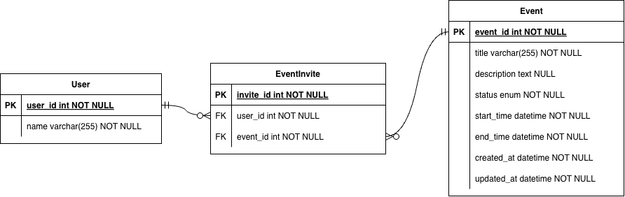
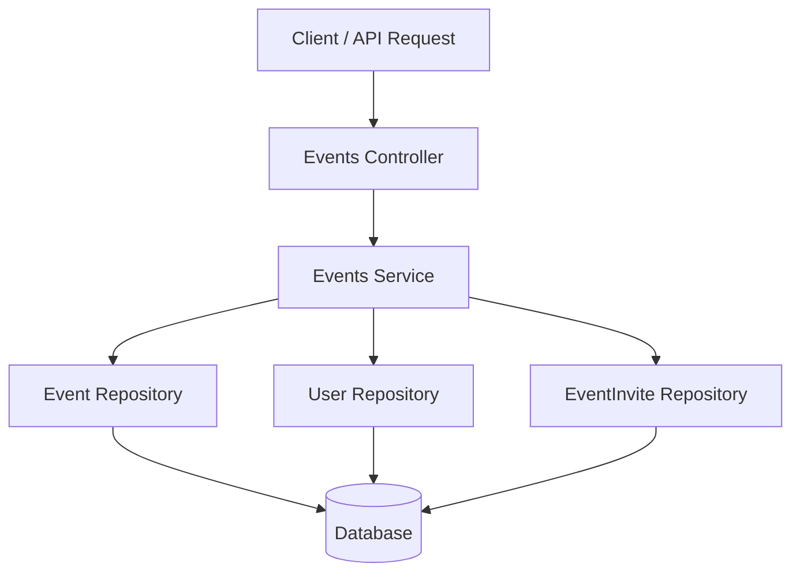
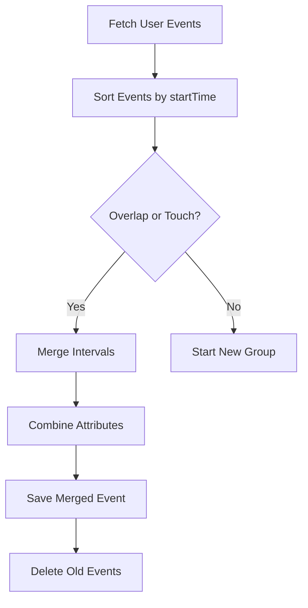

# Event Management Backend (NestJS)

This project is a backend API built with **NestJS** and **TypeORM** that manages users and events.  
Users can create events, invite participants, and merge overlapping events.

The main feature of this project is an **event merge algorithm** that detects overlapping or touching events for a specific user and merges them into a single event.

---

# Tech Stack

Backend Framework  
NestJS

Language  
TypeScript

ORM  
TypeORM

Database  
SQLite (for local development)

Testing  
Jest  
Supertest (for e2e testing)

Architecture Style  
Modular NestJS architecture

---

# Project Structure
```
src
│
├── app.module.ts
├── main.ts
│
├── users
│   ├── users.module.ts
│   ├── users.controller.ts
│   ├── users.service.ts
│   ├── dto
│   │   └── create-user.dto.ts
│   └── entities
│       └── user.entity.ts
│
├── events
│   ├── events.module.ts
│   ├── events.controller.ts
│   ├── events.service.ts
│   ├── dto
│   │   └── create-event.dto.ts
│   └── entities
│       └── event.entity.ts
│
├── event-invites
│   └── entities
│       └── event-invite.entity.ts
│
└── common
    └── enums
        └── event-status.enum.ts
```
The project follows a typical NestJS modular structure.

Controllers handle HTTP requests  
Services contain business logic  
Entities represent database tables  
DTOs validate incoming request data

---

# Database Design

The system uses three main entities.

## User

Represents a user in the system.

Attributes

- id
- name

A user can be invited to multiple events.

---

## Event

Represents an event with a time interval.

Attributes

- id
- title
- description
- status
- startTime
- endTime

An event can have multiple invited users.

---

## Database Schema


## EventInvite (Join Table)

Instead of using a direct many-to-many relation, a join entity is used.

Relationships

User  
1 → many → EventInvite

Event  
1 → many → EventInvite

EventInvite  
many → 1 → User  
many → 1 → Event

---


# API Endpoints

## Create User

POST /users

Example request
```
{
"name": "Jake"
}
```
---

## Get User

GET /users/:id

---

## Create Event

POST /events

Example request
```
{
"title": "Team Meeting",
"description": "Weekly sync",
"status": "TODO",
"startTime": "2026-03-13T02:00:00.000Z",
"endTime": "2026-03-13T03:00:00.000Z",
"inviteeIds": [1,2]
}
```

---

## Get Event

GET /events/:id

Returns the event along with invited users.

---

## Delete Event

DELETE /events/:id

---

## Merge Events For User

POST /events/merge/:userId

This endpoint merges overlapping or touching events for the given user.

Example

Event A  
02:00 - 03:00

Event B  
02:30 - 04:00

Merged Result

02:00 - 04:00

---

# Event Merge Algorithm

The merge feature uses the classic **interval merging algorithm**.

Steps

1. Retrieve all events associated with a user.
2. Sort events by startTime.
3. Scan the list from left to right.
4. If the next event overlaps or touches the current interval, merge them.
5. Continue merging chained overlaps.
6. Create a new merged event.
7. Combine invitees from all merged events.
8. Remove the original events from the database.

---

# Attribute Merging Strategy

When multiple events are merged, attributes are combined as follows.

## Title

Titles are concatenated.

Example

```
Event A | Event B
```


---

## Description

Descriptions are concatenated if present.

---

## Status

A priority rule is applied.

Priority order

```
IN_PROGRESS
COMPLETED
TODO
```

If any merged event is IN_PROGRESS, the merged event becomes IN_PROGRESS.

---

# Testing

The project includes **End-to-End tests** using Jest and Supertest.

The tests simulate real HTTP requests to verify the behavior of the API.

Covered endpoints

- POST /users
- POST /events
- POST /events/merge/:userId

Run tests with

```
npm run test:e2e
```

---

# Running the Project

Install dependencies

```
npm install
```

Start the server
```
npm strat:dev
```

Server runs at
```
http://localhost:3000
```

---

# Example Workflow

Example workflow for merging events

1 Create a user

POST /users

2 Create overlapping events

POST /events

3 Merge events

POST /events/merge/:userId

4 Retrieve merged result

GET /events/:id

---

# Design Considerations

This implementation focuses on

- clean NestJS modular architecture
- clear separation of controller and service layers
- proper relational database design
- algorithmic correctness for interval merging
- maintainable and testable service logic

---


# Backend Architecture Diagram



# Event Merge Flow Diagram

# Data


